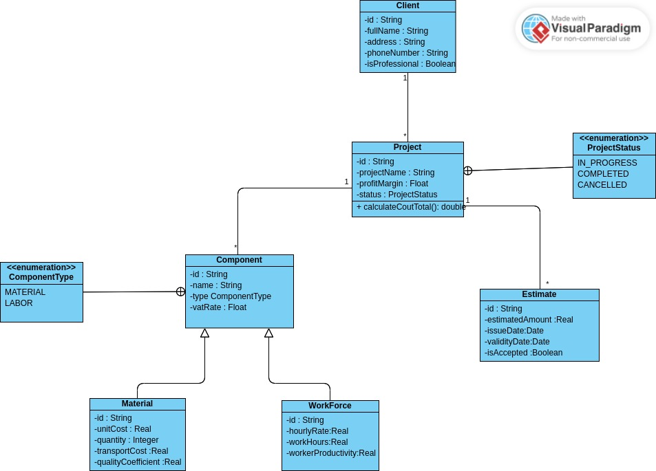

# BatiCuisine

## Class Diagram

This class diagram illustrates the structure of the BatiCuisine system:

- **Client**: Represents a client with attributes like id, fullName, address, phoneNumber, and isProfessional.
- **Project**: Represents a project associated with a client. It has attributes such as id, projectName, profitMargin, and status (which is of type ProjectStatus enumeration).
- **Component**: An abstract class representing a component of a project. It can be either Material or WorkForce.
- **Material**: A subclass of Component, representing physical materials used in a project.
- **WorkForce**: A subclass of Component, representing labor or services in a project.
- **Estimate**: Represents an estimate for a project, including attributes like estimatedAmount, issueDate, and validityDate.

Key relationships:
- A Client can have multiple Projects (1 to many relationship)
- A Project can have multiple Components (1 to many relationship)
- A Project can have one Estimate (1 to 0..1 relationship)

The diagram also includes enumerations for ProjectStatus (IN_PROGRESS, COMPLETED, CANCELLED) and ComponentType (MATERIAL, LABOR).